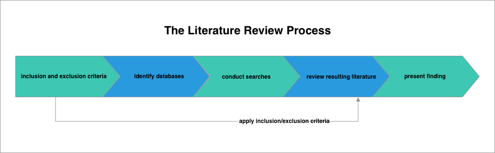
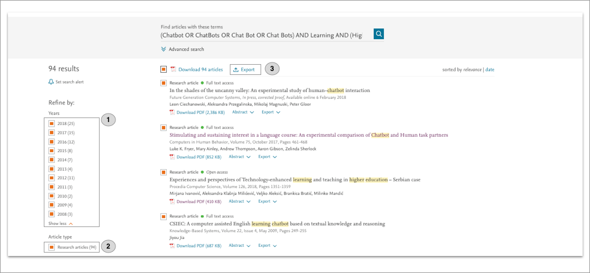
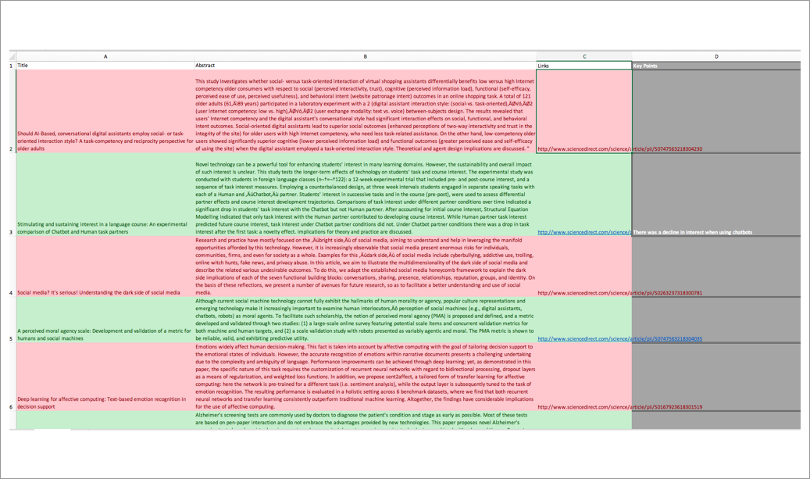

# How to conduct a literature review 

A literature review is the process of searching, critically appraising and interpreting the literature that relates to your research topic. Although there are many different types of reviews, within Graduate Professional Development and for your final year project we are going to be following a systematic approach.

 A systematic literature review is one that follows a series of repeatable steps known as a 'protocol'. In this context a protocol is useful as it allows us to provide you with a recipe detailing how to conduct a literature review. 

>> Figure 1, The Solent University literature review protocol 

## Prior to conduction your literature review 

As computing students we think in an applied way, we want to make things, get our hands dirty and get stuck into designing or developing a prototype. This can lead to us focusing on tools, techniques and implementation details too early in the process. For instance, let's assume that you wanted to make a chat bot to help students learn in higher education. At this early stage you want to try and avoid focussing on the tools and techniques to actually make a chat bot.  Instead, you should clearly define a problem statement along with a research question or hypothesis.   

### Problem Statement:

A problem statement should:

- Identify an issue 
- Reference the problem using the literature 
- How the research will address the problem 

Below is an example of a good problem statement:

Programming is a fundamental skill taught to computing students on higher education
courses. However, it’s generally agreed that many students struggle when it comes
to learning programming (Robins et al., 2003a).
With it being accepted that it takes an estimated 10 years of relevant experience
to transform oneself from a novice into an expert programmer (Winslow, 1996), it’s
clear that programming is a demanding skill to acquire. This research intends to develop a chat-bot to assist undergraduate students in the demanding task of learning to program.

    
**Research Question:** In what ways will a implementing a chatbot assist first year novice programmers in learning to program?  

 
 >> **Tip** - at this stage you should ensure there is plenty of literature surrounding your research topic. [A simple search of Google Scholar can be used](https://scholar.google.co.uk/)
 
Doing the above sets the focus for your research and lays a clear forward facing path. If you are struggling in framing your idea in an academic style you should speak to your tutor.
 
# The review protocol 

Below I shall summarise the review protocol that you should use for your final year project and for Graduate Professional Development (assessment 2).  To aid further explanation, I will continue building on the above illustrative idea of creating a chat bot to assist learning in higher education.

## 1. Develop inclusion and exclusion criteria 

Inclusion and exclusion criteria help you identify what you need to search for when conducting your literature review. Below is an example of what the given criteria may look like for our chat bot application:

### Inclusion criteria 

- Primary sources relating to chat bots used for education or learning purposes 
- English language only 
- Published in peer reviewed journals 
- Study took place in the last 10 years 
- Empirical studies that took places in a higher education setting
- The Study reported research methods and results

### Exclusion criteria

- Sources that are related to chat bots not used in an educational or learning setting 
- Non English language 
- Non peer reviewed sources 
- Study took place over 10 years ago 
- Study did not take place in a higher education setting

It is important to refer to and review your inclusion and exclusion criteria while you are searching. You may need to adjust your criteria if your research focus begins to evolve as a result of performing your literature review. 

## 2. Identify databases 

 Once you know what type of literature you need to address your research idea and have developed your inclusion and exclusion criteria, you are ready to begin searching for literature. I recommend using online academic databases to conduct your search. 

While the library has subscriptions to a [range of databases](https://libguides.solent.ac.uk/az.php?s=125080), I recommend using [ScienceDirect](https://www.sciencedirect.com/search/advanced).

## 3. Identify keywords

You should identify the keywords that capture the essence of your research topic. The rational behind this is that journal articles are indexed on databases using keywords. 

### Keywords 

The keywords for are chat bot study could be as follows:

**ChatBot, ChatBots, Chat Bot, ChatBot, Higher Education, University, Learning, Adult Education, Adults**

## 4. Conduct searches 

>>Figure 2, Science Direct search results

We are now ready to conduct our searches. When conducting your search you should make use of Boolean operators - AND/OR/NOT. These commands use the principles of boolean logic, a concept that as a computing student you should be familiar with.

Using the above principles this is what our chat bot study search string might look like:

**(Chatbot OR ChatBots OR Chat Bot OR Chat Bots) AND Learning AND (Higher Education OR Adult Education OR Adults)**

After conducting our search we can now start applying our inclusion criteria. In Figure 2 you can see that we have filtered by date (Figure 2, annotation 1) and just to include research articles (Figure 2, annotation 2). After applying our criteria you can see that we have 94 remaining articles. This is a very good seed for our literature review. We now need to get the literature into a format that lends itself to more in-depth analysis.

### Exporting the search results to excel

Unfortunately ScienceDirect does not allow us to export to Excel. As such, firstly we select all our sources and click export (Figure 2, annotation 3) and 'Save to Refworks'. Next, from within RefWorks select your articles and click: 

 `share -> export references -> Tab Delimited (.tsv)`.  

The resulting `tsv` file can now be opened in Excel, and allows us to easily evaluate our articles. 

## 5. Review resulting literature 

>>Figure 3, Reviewing the literature 

Now we have the results in Excel, initially we can just read the abstract of each article and make a quick decision if we want to include and discard the literature. In Figure 3, red rows represent excluded literature and green columns represent included literature. 

You now should read the remaining papers, there should not be that many left, for GPD you can aim for 5 - 10 good quality sources. [You should aim to critically appraise ](https://learn.solent.ac.uk/mod/book/view.php?id=386475&chapterid=62704) and summarise each source. 

**Further Tips**

- Once you have identified the key articles that relate to your research idea, it is useful to study the reference lists of those key articles for further references that may be useful to you. 

- If a key theme or author keeps arising in your literature results then it is well worth conducting further research into this given author

## 6. Present your findings

We are now ready to present our findings. Firstly, we need to document our search protocol. You can adapt the template presented below to document your own search protocol. **This should be included in your assessment, you can adapt the below template:**

>> A search of the online academic database Science Direct was undertaken. The following search query was used: **[insert search query]**.  
 
 
Finally, the following inclusion and exclusion criteria was applied:  
**[list inclusion and exclusion criteria]**
>> The above process resulted in **[number]** studies (see Table **[list of studies]**}). These studies acted as a seed for the initial literature review.  On critically appraising the studies, frequently occurring citations were investigated and used to support the review.

Finally, we need to present summaries of the studies and any themes that have emerged. You should aim to have approximately 10 good quality sources. There are several steps that should be taken:

### 6.1 Summaries each study in a table 

The first step is to summaries each of the papers you have, a simple table will suffice. 

|  Author/Date| Aim Of Study |Data Collection Methods| Main findings|   Sample   |   
|-------------|--------------|----------------------|--------------|-------|
| Jones (2009)|Explores the views of language students using a chat bot vs a human tutor to support learning | Quantitative surveys and focus groups| 70% of students preferred a human tutor over that of a chat bot | 40 undergraduate students|
>> Table 1, Summarising your studies

### 6.2 Compare and contrast each paper

After reading your papers it is now time to critically review and summarise studies. In reality you will only have around 5 sources so you can be quite detailed about each one. Below is an example:

 
 >> ‘Regarding the use of chat-bots for increasing learning, Smith (2006) explored how computing students interacted with this technology. He interviewed ten novice programming first-year university computing students about their experiences with using a chat-bot over the course of 10 weeks. Over the 10 week period, students attended, weekly, two-hour practical sessions where they undertook basic programming tasks using the programming language Python. Along with human tutor support, students also had access to a custom chat-bot implemented in botman.io.  Students could query the chat-bot, in a natural language style, for programming support. It was identified that while some students found the tool useful the majority noted that it had no effect on their learning. This was a small study, undertaken by a researcher who was also teaching the students. As such, there may have been potential for observer biased. (Adapted from Aveyard, Helen. Doing A Literature Review In Health And Social Care : A Practical Guide, McGraw-Hill Education, 2014)
 
 

>> Recall our critical evaluation tool
>> Aveyard, H., 2014. Doing a literature review: A practical guide. McGraw-Hill Education (UK).

  
