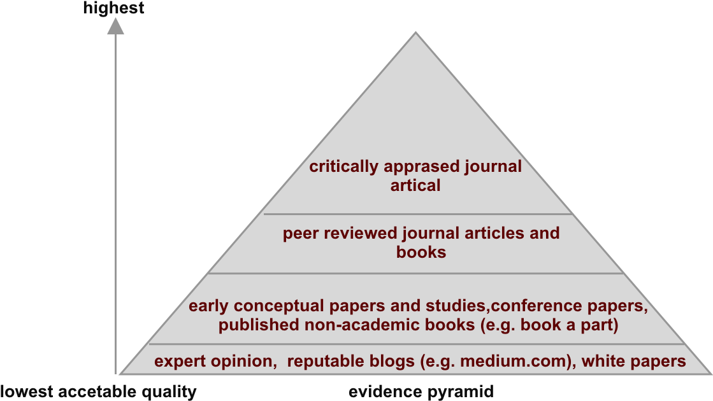

# Week 10  - Searching and Exporting the Literature

### Session Schedule 	

| Time | Activity   |                                              
|-------------------|----------------------------------------------|
| 0 - 10 mins        | 
Students arrive, no need to logon as the tutor will be presenting
  |
| 10 - 15 mins       | 
 Tutor starts at one end of the class, in turn each student should announce there current final project ideas 
 
 The tutor may want to stress the point that they should have some idea by now 
 
Furthermore, the can lead the students down the path of framing this idea within a research framework 

| 15 -  25 mins      |  
 Tutor revisits and talks about inclusion and exclusion criteria, and demonstrate how to access and search Science Direct   
  |
| 30 - end of session      |   
 Students begin the activity 
 
 Tutor should circulate the room, checking each task has been completed and questioning students of their process 
 |
|
|

### Introduction

You should all note that assessment 2 is now live on your respective SOL pages. Hopefully you recall [from the lecture last week](../week_9/lecture_presentation.md) the main focus of this assessment is to conduct a literature review, the focus of which will be exploring like studies to your project idea. The assessment rests on two premises: firstly, you have a project idea and secondly you know how to conduct a literature review. The latter point will be worked on in these seminar sessions, the former you should be well on your way to achieving, even if it is just a rough idea.   

In this session we are going to work on the second part of our systematic review process, searching and extracting studies.  Hold on, what was the first part?  [The first part should be developing your problem statement and research question/hypothesis](../week_9/seminar.md).

###  Activity 

This activity consists of a number of steps, you should try and speak to your tutor after each.   
In an ideal world you should have a very rough idea of what you are doing for your final year project. If this is the case this will form the subject of your lit review. If you do not have an idea, just make one up for the sake of this activity.

1) **Getting going** - open up a word/google docs to document your review. Remember, it's systematic, we need to know each step, it must be repeatable this is one of the key tenants of science**

2) [Open up the systematic review guidance](../literature_review_protocol.md) . This will act as our notes for today's session. 

3) Complete step 1-5 in the [systematic review guidance](../literature_review_protocol.md). 

4) By the end of the session you should have a filtered list of studies in a spreadsheet. aim for 5. You will need to tweak your inclusion and exclusion criteria to achieve the correct number.  Also, revisiting our evidence pyramid (see below) may be useful at this stage. You are aiming for the top of the pyramid, however if this is not possible you can navigate downwards towards more readily available documents. 

### Useful Resources 

[Solent Literature Review Protocol](../literature_review_protocol.md)
