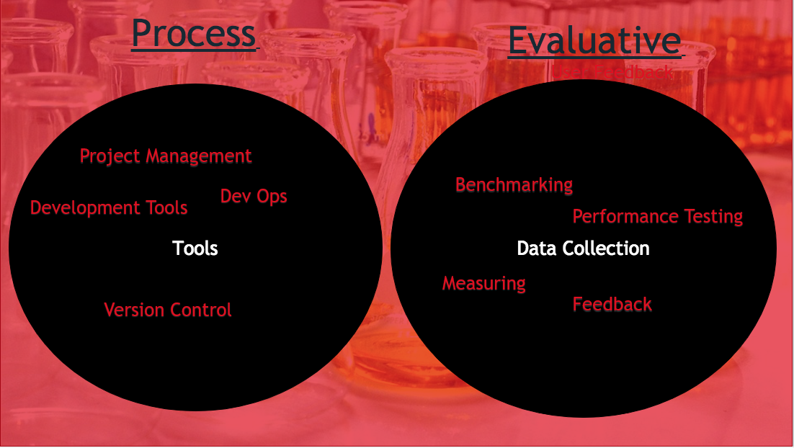

# Week 10 - Methods

Methods will make up one of the most important sections of your final year project, they ensure the repeatability of your work. They are documented as a **past tense** account of the tools, instruments and processes that were used to deliver your project. While in reality studies, including your own, won't actually be repeated, methods are still important as they allow the ways in which you conducted your study to be scrutinised. Speaking broadly, for your final year project, your methods will be split between process and evaluative (see Figure 1). I shall briefly explore these different method types below.

>> Figure 1, process vs evaluative methods

### Process methods

Process methods will make up a simple section of your report. They are simply a list of important tools and management processes that you used to deliver your project. For instance, you may have used:

- Git and GitHub to manage version control
- Travis to take care of continuous integration and deployment
- FireBase to host your work
- Trello and a Gant chart to handle task management
- OneNote as a research log

**IMPORTANT:** There are a couple of common mistakes that students make. **Firstly**, don't endlessly talk about alternative tools or techniques that you never actually used. For instance, if you used Trello for project management, you just need to document your justifications for using this tool. Do not fall into the trap of listing several other project management tools, this severs no purpose. **Secondly**, don't tell us that you used a team software development methodology (e.g. agile, spiral, waterfall...) to manage your project. These methods are not suitable as you will be working alone so why use a team methodology. While you can certainly use these development methodologies as inspiration, ensure you adapt them to the needs of your project. While process methods sit in the background and would have assisted you in delivering your project, evaluative methods measure the successes of your project.

### Evaluative methods

Evaluative methods can be split between qualitative, quantitative and mixed (a mixture of qualitative and quantitative). Qualitative data is non-numerical and can be used to get rich contextual user opinion on your project artefact. More often than not, data of a qualitative nature will be used to answer a research question. Quantitative data, on the other hand, is numeric and is used to prove or disprove a hypothesises. Regardless of whether you pick qualitative, quantitative or mixed methods, you are going to need to consider how you actually gather this data.

### Data Collection

In order to collect data you need to set up some form of experiment or planned evaluation of your artefact. This may be getting some targeted end users to test your web app or software. Or, if you're a networking student,  measuring key performance variables on a simulation or real life network. Next, let us consider some example methods that you can use to evaluate the outcomes of this experiment or user evaluation.

####  Quantitative Methods

 Some example quantitative methods include:

- Request per Second (Web Based)
- System Load Average
- Memory Usage
- Response Time
- Metrics from auditing tools (e.g. [Light House](https://developers.google.com/web/ilt/pwa/lab-auditing-with-lighthouse))
- Usability Lab Tests (e.g. gaze plots, eye tracking), ensure these methods serve a purpose, do not just use them because they are easily available

A good paper to read that utilises quantitative methods is by [Olanrewaju Et al.](https://www.researchgate.net/publication/312737643_An_Empirical_Study_of_the_Evolution_of_PHP_MVC_Framework)  (2015). The paper compares the performance of different PHP frameworks, however, the methods they use could easily be generalised to other types of projects. A final point of note, it is possible to use a quantitative scale to measure human perception. You've all seen these strongly agree to strongly disagree type questions. While you can, by all means, collect data in this manner, I recommend you use it to complement other methods. Collecting data in this manner means you may miss nuanced opinions and gather little in the way insight. If you're focused purely on the human opinion you should consider mixed or qualitative methods.

### Qualitative Methods

Some qualitative methods include:

- Open question surveys
- Focus groups
- Interviews

While qualitative data is arguably easier to gather than quantitative data, it is a more time consuming undertaking to analyse it. Firstly, you need to get the data into a suitable format for analysis. For instance, if you are using focus groups or interviews, this means recording then transcribing the recording to allow for textual analysis. Finally, you need to understand the data and tell the story that it reveals. It is common to organise the data into broad themes, such an approach is know as thematic analysis (google it).

In summary, whether you use qualitative, quantitative or mixed methods, ensure you use methods that actually help you evaluate your artefact.  It is common to use several methods, but ensure that every method actually tells you something useful about your artefact. If you are unsure then speak to your supervisor/tutor.

#### References

[Olanrewaju, R.F., Islam, T. and Ali, N., 2015. An empirical study of the evolution of php mvc framework. In Advanced Computer and Communication Engineering Technology (pp. 399-410). Springer, Cham.](https://www.researchgate.net/publication/312737643_An_Empirical_Study_of_the_Evolution_of_PHP_MVC_Framework)

