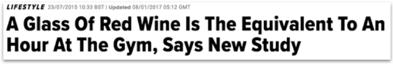
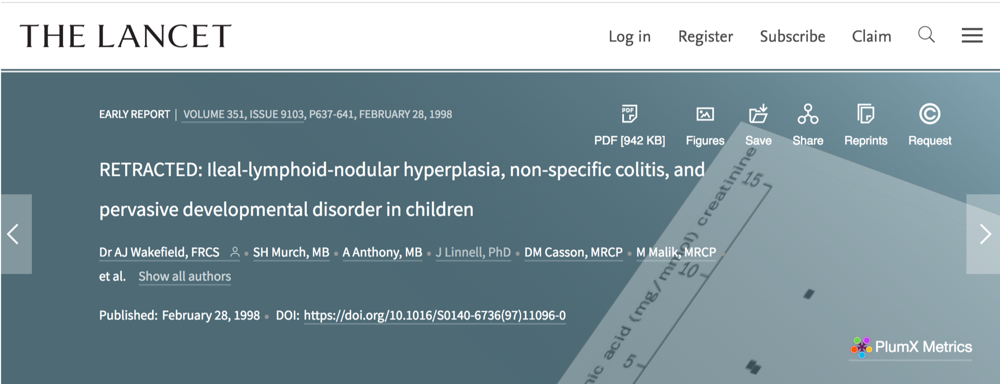
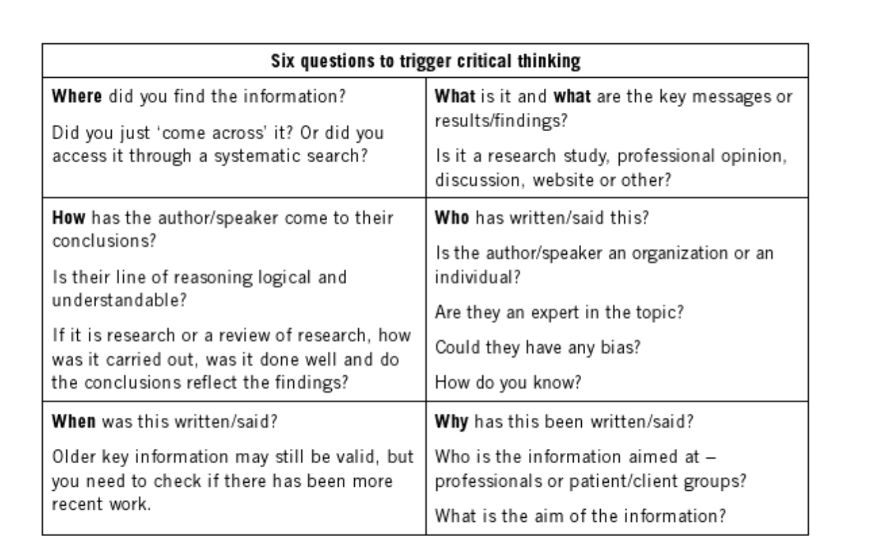

# Notes

Within higher education, terms such as critical thinking or critical analysis are thrown around with disregard. They adorn unit descriptors, marking rubrics and are peppered across assessment feedback. These ideas are indeed vital skills that every graduate, regardless of the study area, should possess. However,  up until this point, the reality of what these concepts mean may be hazy at best.   If you feel this way, you are in good company; according to Moon (2017), even academics cannot decide on a common definition.  There are, however, common ideas that we can agree upon. 

### What is critical thinking?

It is perhaps counterintuitive, but critical thinking is not about criticising. Rather, it is the idea of judging the meaning and significance of claims, as opposed to believing everything you see, hear or read. In a world of "fake news" critical thinking has never been more important.  

### Do not believe everything you read

[Take, for example, following headline appearing in a widely read 2017 Huffington Post article](https://www.huffingtonpost.co.uk/2015/02/11/another-good-reason-to-drink-red-wine_n_7316692.html):
Should we be ditching the gym in place of a glass of wine? - Well, unsurprisingly, and perhaps sadly, no!  

It turns out, this article is based on the outcomes of a study by University of Alberta researcher - Dr Jason Dyck (2012).  The small-scale study presented findings a compound, known as resveratrol, found in nuts, some fruits and red wine enhanced the effect exercise in rats.  The reality of the study is very different than the Huffington Post article suggests.  However, I suspect, the actual title of the original research paper,  would not have generated much in the way of social media buzz.  While you may only need limited critical skills to judge the validity of the previously mentioned article it is not always so simple to make a critical judgement about the validity of the information at hand. 

As a second example, consider a study by Andrew Wakefield concluding there is a link between the onset of autism and bowel disease with the MMR vaccination. These findings were presented in one of the most prestigious peer-reviewed medical journals - the Lancet.  The results were heavily reported by mainstream news sources and lead to a decline in adults getting their children vaccinated. However, the work was later discredited and redacted.  On further exploration of the paper, it is very clear why.  There is a lack of a comparison group; and the sample size consisted, of a tiny, 12 children and is non-random.  Nonetheless, this worked passed the peer-review process and convinced many mainstream media outlets to report on it.  It is my goal, in this unit, to equip you with the critical skills to be able to make an informed judgment on work such as this yourself.  Such a skill, by many, is considered the difference between graduates and non-graduates.

The ideas of what it means to be a graduate varies. However, a definition that I work towards was proposed by Biggs 2011:

 >> "Graduates are thought to feel a need to seek and evaluate the evidence before coming to a conclusion, not to accept ‘spin’ as readily as non-graduates, to question the status quo, to show intellectual curiosity about the social world" (Biggs 2011, p.111)

In summary, we will be working towards equipping you with an ever-increasing mental tool kit to enable critical thinking. As I hope I have demonstrated this is an important life skill. In time, you will be able to take ideas, evaluate them and use them to create new knowledge.

Finally, I would like to introduced a useful framework  for evoking critical thinking.

### A critical thinking framework

There are several frameworks created to help students with critical thinking. On of my favorite is the above framework created by Aveyard (2007). The framework asks six key questions that are intended to trigger critical thinking. Although Aveyard's book targets health and social care students, the principles still apply across any given topic area. 

### References 

Aveyard, H. (2007). Doing a literature review in health and social care: a practical guide. Maidenhead, Open University Press.

Biggs, J., 2011. Teaching for quality learning at university: What the student does. UK:McGraw-hill education

Dolinsky, W., Jones, E., Sidhu, S., Haykowsky, M., Czubryt, P., Gordon, T. and Dyck, R.,2012. Improvements in skeletal muscle strength and cardiac function induced by resveratrol during exercise training contribute to enhanced exercise performance in rats. The Journal of physiology, 590(11), pp.2783-2799.

Moon, J., 2007. Critical thinking: An exploration of theory and practice. Routledge.

Moon, J., 2006. We seek it here... a new perspective on the elusive activity of critical thinking: a theoretical and practical approach’, ESCalate Discussion Series.
